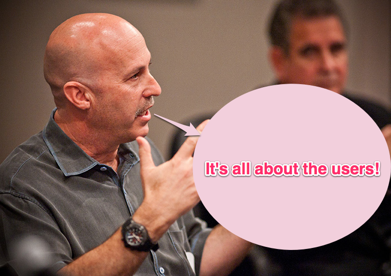
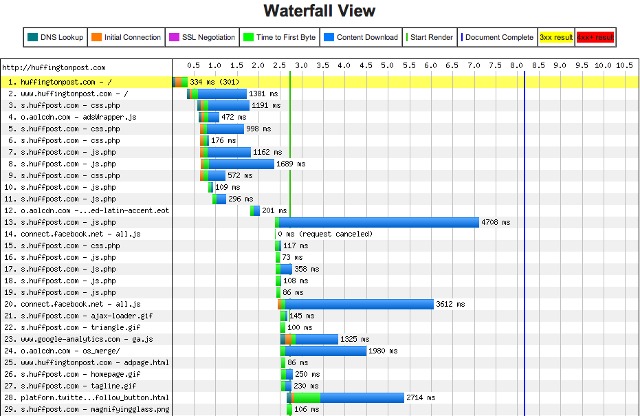

!SLIDE center transition=scrollUp
# Google PageSpeed #

!SLIDE transition=fade
# What Is It? #

* a tool that analyzes the content of a web page, then generates well-known, best-practice suggestions to make that page faster
* started in 2008 as a Firefox extension

!SLIDE bullets incremental
# How it Works #

* I give Google a URL
* Google fetches and renders URL
* Google runs PageSpeed against the request
* I get a score, suggestions for improvement

!SLIDE subsection
# Why Should We Care? #

!SLIDE center transition=scrollUp
# Reminder: WWMCS #

!SLIDE
# Plain and simple #

* Webpages are getting richer
* Making users wait too long != good
* They will want to leave

!SLIDE
# Oh, and KPI #

* Amazon found that for a 100ms decrease in latency => +1% in revenue
* Edmunds found -50% decrease load time => +17% page views per session

!SLIDE
# Using PageSpeed #

* [Online](https://developers.google.com/pagespeed/)
* [Chrome](https://developers.google.com/speed/pagespeed/download#extension-rel-chrome) and [Firefox](https://developers.google.com/speed/pagespeed/download#extension-rel-ff) Extensions
* [PageSpeed SDK](https://developers.google.com/speed/pagespeed/download#pagespeed-sdk)
* [PageSpeed Service](https://developers.google.com/speed/pagespeed/service) - involves DNS, PAID

!SLIDE subsection
# Ex: HuffingtonPost (IE8) #

!SLIDE
<iframe width="960" height="720" src="http://www.youtube.com/embed/a-ZO94wdlJo" frameborder="0" allowfullscreen></iframe>

!SLIDE center

!SLIDE subsection
# PageSpeed Analysis #

!SLIDE center
# Quick Reminder #
* Google PageSpeed is going to generate well-known, best-practice suggestions for us.

!SLIDE subsection
# Setup: Firefox Extension #

!SLIDE center
<iframe width="960" height="720" src="http://www.youtube.com/embed/bIKVxO-PCHE" frameborder="0" allowfullscreen></iframe>

!SLIDE subsection
# PageSpeed in Action #

!SLIDE center
<iframe width="960" height="720" src="http://www.youtube.com/embed/MiqPlevRBCY" frameborder="0" allowfullscreen></iframe>

!SLIDE subsection
# The Guts: Resources #

!SLIDE
<iframe width="960" height="720" src="http://www.youtube.com/embed/y1lcPhOzu1A" frameborder="0" allowfullscreen></iframe>

!SLIDE subsection
# A little goes a long way #

!SLIDE center
# Larry Page on Speed #
* ...speed is one of [Larry] Page's primary obsessions. "He's always measuring everything," early Googler Megan Smith says. She was once walking with Page down a street in Morocco when he suddenly dragged her into an internet café. Immediately, he began timing how long it took web pages to load into a browser.

!SLIDE center
* ..."When people do demos and they're slow, I'm known to count sometimes," Page says. "One one-thousand, two one thousand. That tends to get people's attention." Paul Buchheit, the creator of Gmail, remembers performing an early demo of that service in Page's office. Page made a face and told him that it was way too slow. Buchheit objected, but Page reiterated his complaint, charging that it was taking at least 600 milliseconds to reload. Buchheit thought, "You can't know that." But when he got back to his office he checked the server logs. Six hundred milliseconds. "He nailed it..."- [Wired](http://www.wired.co.uk/magazine/archive/2011/05/features/the-second-coming-of-larry-page)